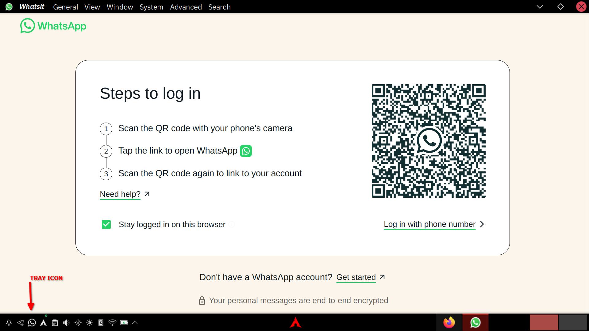
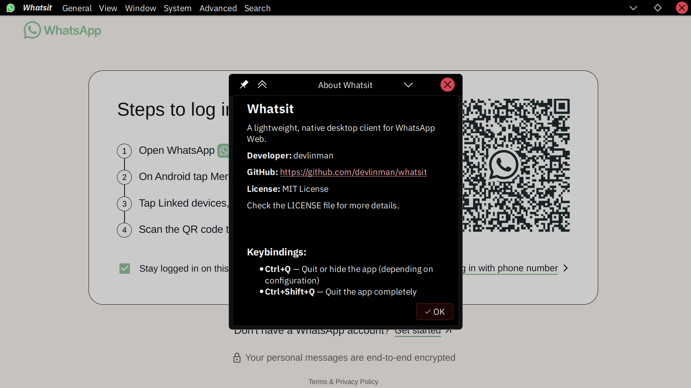

<p align="center">
  <!-- Core Tech -->
  
  

  <!-- OS -->
  
  

  <!-- Desktop / Environment -->
  

  <!-- Extras -->


<!--Start--->
<br>
<h1 align="center">Mr. Whatsit</h1> <p align="center"> <sub><span style="color: gray;">From <i>Stranger Things</i> S5</span><sub></p>

**Author:** _devlinman_
## About Whatsit

- A lightweight, native desktop client for WhatsApp Web built with `Qt 6` and `Qt WebEngine`, and is **NOT** Electron-based.

- I have tried many Whatsapp web clients, but none of them are fast and light. None of them felt right...

- My setup is Arch-KDE Plasma-Wayland. If your setup is similar, the app should work well.

- In `v3.x.x`, additional features such as memory kill switch and custom app and tray icons, etc. You may call these features bloat, but I like to have those. If you don't want those, use lower versions of the app.

- If you want the minimal and bare version, use `v1.0.1`. Tray icon and Notifications are implemented in `v2.0.0`.

### Features

- Native Qt 6 & Qt WebEngine-based
- Persistent login and chat storage
- Uses standard XDG directories
- KDE / Wayland friendly
- KDE Native Notification support
- Reduce memory usage & kill switch
- Opens whatsapp links from browsers to send messages
- Tray icon indicator for new messages 

---
## Screenshots
<p align="center">
  
</p>

<p align="center">
  
</p>

---
## Wiki & Documentation

- Check the [wiki docs](https://github.com/devlinman/whatsit/wiki) for more information.

- **Now, Notes is available from  [wiki docs - Notes](https://github.com/devlinman/whatsit/wiki/Notes).**

- It contains important information about the working of the app.
- **It is recommended to have a look.**

### Discussions

- Join the discussions on github to discuss new features, future directions, etc.
- Check [Discussions](https://github.com/devlinman/whatsit/discussions).

### Changelog
- Check `CHANGELOG.md` to see the updates and information about versions and releases (on the master branch).

### Progress & Future
- Check the [Project](https://github.com/users/devlinman/projects/) to track and find information about updates.

### Contribute
- Check [CONTRIBUTING.md](CONTRIBUTING.md).

---
## Install

### Install From AUR

- Now available from AUR - `whatsit-git`. [AUR Package.](https://aur.archlinux.org/packages/whatsit-git)
- Builds from latest commit from git on default branch (master).

```shell
yay -S whatsit-git
```

### Please refer to [wiki docs](https://github.com/devlinman/whatsit/wiki) for more information on Build & Install.


---
## LICENSES

- This project (binary/source code) is licensed under the MIT license, compliant with the third-party licenses mentioned below.
- Check Licensing information at [LICENSE](./LICENSE).
- **Copyright Disclaimer: Whatsapp is not owned by me.**
- The [icons](./resources/) used in this project were grabbed off the internet.

### tldr;

- Use this app at your own risk.
- I will not be liable for any damages.

### Third-Party Licenses

- This project uses the Qt framework (Qt6), including QtWebEngine, by dynamically linking against them. **Links**: [Qt Source code](https://code.qt.io/), [Qt Downloads](https://download.qt.io/).

- Check [Qt NOTICE](./LICENSES/Qt-NOTICE.txt) for more information. Qt is licensed under the GNU Lesser General Public License v3 ([LGPL v3](./LICENSES/LGPL-3.0.txt)).


<div align="center">

<br>
<div align="center">
  
</div>
<br>

</div>